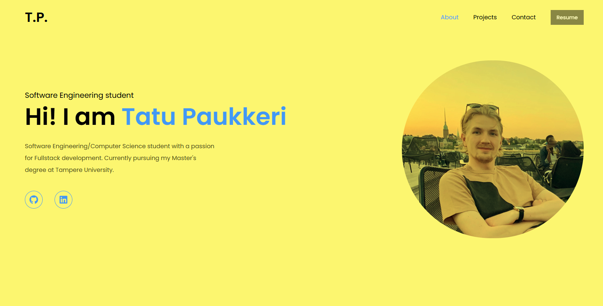
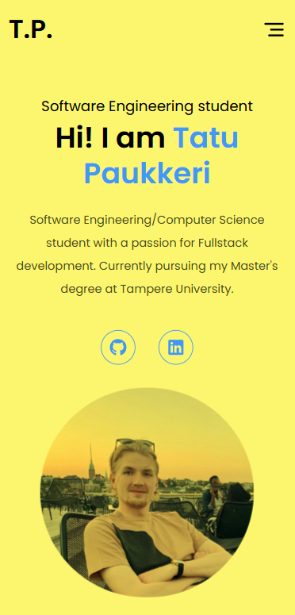

# Portfolio

<!--about project-->

Personal portfolio to showcase my skills and some of the projects I have worked on during my studies.

<!-- pictures? -->

## Features

- Homepage with short bio
- About me page with skills section
- Projects showcase carousel
- Contact page with messaging feature
- Responsive design
- Page transitions

## Built with

This project is built using modern web development technologies:

- [![React][React]][React-url] - A JavaScript library for building user interfaces.
- [![Next.js][Next]][Next-url] - A React framework for production.
- [![shadcn/ui][shadcn]][shadcn-url] - A component library for building accessible and customizable UI.
- [![TailwindCSS][Tailwind]][Tailwind-url] - A CSS framework for rapid UI development.

## Workflow

The project uses GitHub Actions [workflow](https://github.com/taturaattori/portfolio-page/blob/main/.github/workflows/main.yml) to ensure working pushes/pull requests to main branch. New commits to main are automatically deployed to Vercel.

## User Interface
 

   
   
 

<!-- MARKDOWN LINKS & IMAGES -->
[React]: https://img.shields.io/badge/React-%2320232a.svg?logo=react&logoColor=%2361DAFB
[React-url]: https://react.dev/
[Next]: https://img.shields.io/badge/Next.js-black?logo=next.js&logoColor=white
[Next-url]: https://nextjs.org/
[shadcn]: https://img.shields.io/badge/shadcn%2Fui-000?logo=shadcnui&logoColor=fff
[shadcn-url]: https://ui.shadcn.com/
[Tailwind]: https://img.shields.io/badge/Tailwind%20CSS-%2338B2AC.svg?logo=tailwind-css&logoColor=white
[Tailwind-url]: https://tailwindcss.com/
